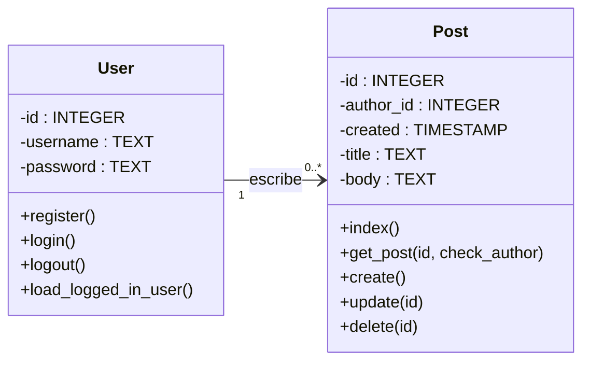

# Diagrama de clases de Flaskr

Este archivo sirve para mostrar las clases User y Post de la aplicación Flaskr, con sus atributos, operaciones y la relación entre ellas.

```mermaid
classDiagram
    direction LR

    class User {
        -id : INTEGER
        -username : TEXT
        -password : TEXT
        +register()
        +login()
        +logout()
        +load_logged_in_user()
    }

    class Post {
        -id : INTEGER
        -author_id : INTEGER
        -created : TIMESTAMP
        -title : TEXT
        -body : TEXT
        +index()
        +get_post(id, check_author)
        +create()
        +update(id)
        +delete(id)
    }

    User "1" --> "0..*" Post : escribe
```